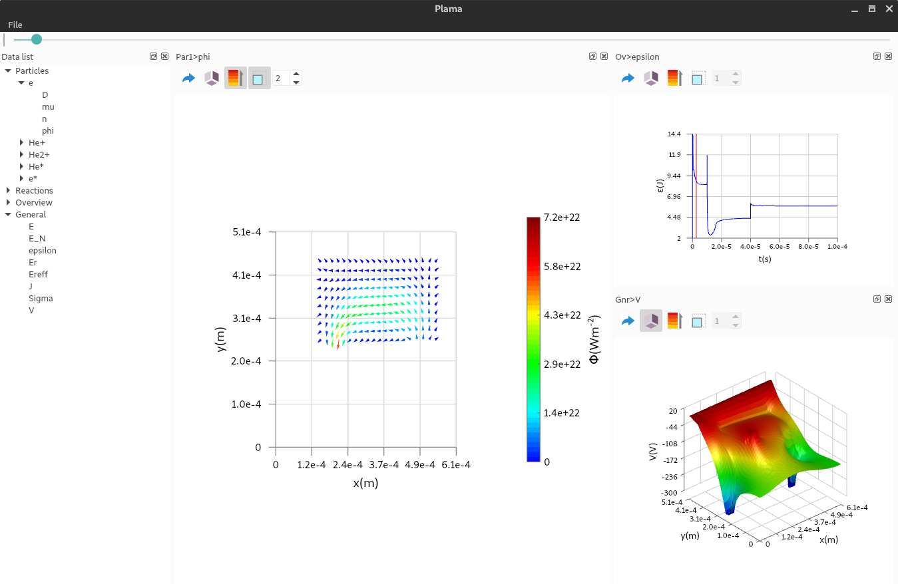

This is Plama, a program for data visualization. It is designed to render the data in plasma simulation, but it should work well for different formats of data.

Here is the main interface:

These are three main formats of rendering supported by this program as you can find in the screenshot. All the plots can be rotated and rendered in 3D space, toggling shader effect, and exported into jpg, svg and pdf images. The main advantage of this program is it has one variable dimension (the slider bar at the top), typically being the time, so you can easily check different quantities of one model at any time. For time-variant data, it can be also exported into videos.

## Why Use It

The purpose of this project is to provide a universal interface and user-friendly workflow for basic visualization of most data formats. You can read, view and export data with several clicks. It also provides descent performance and rendering quality.

So the typical usage is to load some formatted data. You need to install / write the plugin for this format, and enjoy. If you are a big fan of MATLAB or other similar tools, it might not be attractive at all. But to me, it provides better performance in rendering, simpler usage, optimized details and to be honest, the rendering style is closer to my taste. In addition, it uses python for data processing, which is more convenient for text and file processing, and it is more like the industrial standard in programming community.

In one sentence, it is a light-weighted, free and flexible data visualizing tool.

## How to Use

This program has built-in support for a plasma simulation file format called `MD2D`, so you can directly open projects in this format without any configuration. Simply choose open, and select all the output data, and the input model file, then it will handle all the things.

If you do not have MD2D format data, [here](doc/demo.7z) is a simple example to help you run it an test most of the features. The data files are given in data folder and `pdp_demo.md2d` is the input model file.

#### Installing the Plugin

This program aims to provide zero-configuration experience for any data format, through a plugin system. When you have the plugin to process the data format, you only needs to click open, then select the files, easy.

But you might have already thought about, you need to install the plugin first. A plugin is basically a python file. Simply throw it into the config folder , then the program will load it automatically if it runs. The config location is given below:

- Linux: `/home/username/.config/Plama`
- Windows: `C:/Users/username/AppData/Local/Plama`

#### Write a Plugin

This program implements possibly the easiest way to write plugins. For the description of plugin protocol, please find corresponding sections in the [full report](doc/Report/final-report_juntong-liu_201219267.pdf).

## How to Compile

#### Linux

First you need the dependencies (python3 please):

`sudo pacman -S qt5-base qt5-svg python ffmpeg`

Then the typical way for Qt projects:

`qmake && make && make install`

#### Windows

Well, I don't suggest compile it yourself on Windows, not only because I use QtCreator to compile and run it on Windows, but also for the complicities of the dependencies. Why not use the released executable? By the way, I use mingw to compile it on Windows.

#### OSX

Not tested, not supported, have fun yourself.

## About the Project Name

"Plama" sounds to be a strange name, and here is the reason. As stated before, the main purpose of this project is to display plasma properties, so it takes 5 letters from the word "plasma". And since I'm Chinese, and the animal "lama" has very popular jokes in Chinese (not so suitable for work), so it also provides 4 letters. In addition, "Plama" is a Polish word meaning stain, which is the logo of this project (No offense, Ubuntu!). And finally as a Linux user, here is the recursive abbreviation: Plama leaks all memory available! Just try not being a boring person.

## Credits

- Project supervisor: Dr Mark Bowden
- Project assessor: Dr James Walsh
- Some icons from [Numix Project](https://github.com/numixproject) under GPLv3
- [Qt5](https://www.qt.io/) under LGPLv3
- [FFmpeg](https://www.ffmpeg.org/) under LGPLv3
- [Python 3](https://www.python.org/) under PSF LICENSE
